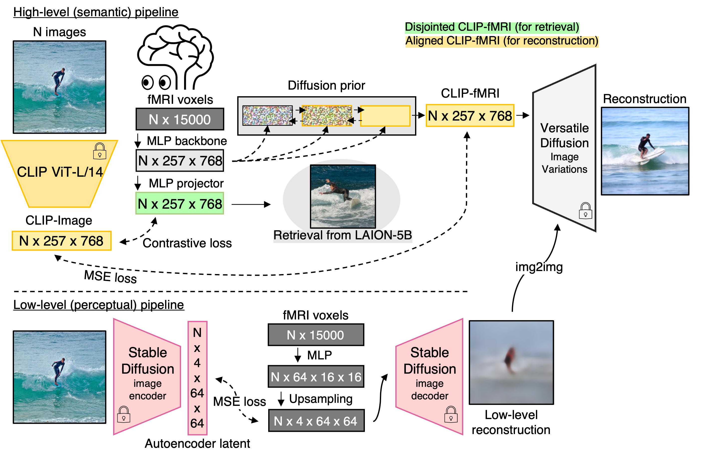

# MindEye fMRI-to-Image reconstruction & retrieval

<br>

## Installation instructions

1. Agree to the following [Terms and Conditions](https://cvnlab.slite.page/p/IB6BSeW_7o/Terms-and-Conditions) and fill out the [NSD Data Access form](https://forms.gle/xue2bCdM9LaFNMeb7). 

2. Download a copy of this repository via "git clone https://github.com/MedARC-AI/fMRI-reconstruction-NSD.git".

3. Create a conda environment that will run the notebooks and training scripts:

```bash
conda env create -f src/environment.yaml
conda activate medical-v1
```

4. (optional) For LAION-5B retrieval you will need to map to the last layer of CLIP ViT-L/14 (in addition to the last hidden layer, which is the standard MindEye pipeline). For training MindEye on just the last layer (aka "4 ResBlocks + Only CLS" in the paper), you will need to cd into the "src" folder and run ``. download.sh``. This will allow you to train the diffusion prior from a pretrained checkpoint (text to image diffusion prior trained from LAION-Aesthetics).

# Training MindEye (high-level pipeline)

Train MindEye via ``Train_MindEye.py``.

Set ``data_path`` to where you want to download the Natural Scenes Dataset (warning: >30Gb per subject).
Set ``model_name`` to what you want to name the model, used for saving.

Various arguments can be set (see below), the default is to train MindEye high-level pipeline to the last hidden layer of CLIP ViT-L/14 using the same settings as the paper, for Subject 1.

Trained model checkpoints will be saved inside a folder "fMRI-reconstruction-NSD/train_logs". All other outputs get saved inside "fMRI-reconstruction-NSD/src" folder.

```bash
$ python Train_MindEye.py --help
```
```
usage: Train_MindEye.py [-h] [--model_name MODEL_NAME] [--data_path DATA_PATH]
                        [--subj {1,2,5,7}] [--batch_size BATCH_SIZE]
                        [--hidden | --no-hidden]
                        [--clip_variant {RN50,ViT-L/14,ViT-B/32,RN50x64}]
                        [--wandb_log | --no-wandb_log]
                        [--resume_from_ckpt | --no-resume_from_ckpt]
                        [--wandb_project WANDB_PROJECT] [--mixup_pct MIXUP_PCT]
                        [--norm_embs | --no-norm_embs]
                        [--use_image_aug | --no-use_image_aug]
                        [--num_epochs NUM_EPOCHS] [--prior | --no-prior]
                        [--v2c | --no-v2c] [--plot_umap | --no-plot_umap]
                        [--lr_scheduler_type {cycle,linear}]
                        [--ckpt_saving | --no-ckpt_saving]
                        [--ckpt_interval CKPT_INTERVAL]
                        [--save_at_end | --no-save_at_end] [--seed SEED]
                        [--max_lr MAX_LR] [--n_samples_save N_SAMPLES_SAVE]
                        [--use_projector | --no-use_projector]
                        [--vd_cache_dir VD_CACHE_DIR]

Model Training Configuration

options:
  -h, --help            show this help message and exit
  --model_name MODEL_NAME
                        name of model, used for ckpt saving and wandb logging
  --data_path DATA_PATH
                        Path to where NSD data is stored (see README)
  --subj {1,2,5,7}
  --batch_size BATCH_SIZE
                        Batch size can be increased by 10x if only training v2c
                        and not diffusion prior
  --hidden, --no-hidden
                        if True, CLIP embeddings will come from last hidden
                        layer (e.g., 257x768 - Versatile Diffusion), rather than
                        final layer (default: True)
  --clip_variant {RN50,ViT-L/14,ViT-B/32,RN50x64}
                        clip variant
  --wandb_log, --no-wandb_log
                        whether to log to wandb (default: False)
  --resume_from_ckpt, --no-resume_from_ckpt
                        if not using wandb and want to resume from a ckpt
                        (default: False)
  --wandb_project WANDB_PROJECT
                        wandb project name
  --mixup_pct MIXUP_PCT
                        proportion of way through training when to switch from
                        InfoNCE to soft_clip_loss
  --norm_embs, --no-norm_embs
                        Do norming (using cls token if VD) of CLIP embeddings
                        (default: True)
  --use_image_aug, --no-use_image_aug
                        whether to use image augmentation (default: True)
  --num_epochs NUM_EPOCHS
                        number of epochs of training
  --prior, --no-prior   if False, only train via NCE loss (default: True)
  --v2c, --no-v2c       if False, only train via diffusion prior loss (default:
                        True)
  --plot_umap, --no-plot_umap
                        Plot UMAP plots alongside reconstructions (default:
                        False)
  --lr_scheduler_type {cycle,linear}
  --ckpt_saving, --no-ckpt_saving
  --ckpt_interval CKPT_INTERVAL
                        save backup ckpt and reconstruct every x epochs
  --save_at_end, --no-save_at_end
                        if True, saves best.ckpt at end of training. if False
                        and ckpt_saving==True, will save best.ckpt whenever
                        epoch shows best validation score (default: False)
  --seed SEED
  --max_lr MAX_LR
  --n_samples_save N_SAMPLES_SAVE
                        Number of reconstructions for monitoring progress, 0
                        will speed up training
  --use_projector, --no-use_projector
                        Additional MLP after the main MLP so model can
                        separately learn a way to minimize NCE from prior loss
                        (BYOL) (default: True)
  --vd_cache_dir VD_CACHE_DIR
                        Where is cached Versatile Diffusion model; if not cached
                        will download to this path
```

# Reconstructing from pre-trained MindEye

Pretrained Subject 1 models can be downloaded on [huggingface](https://huggingface.co/datasets/pscotti/naturalscenesdataset/tree/main/mindeye_models). Includes mapping to CLIP ViT-L/14 hidden layer (257x768), CLIP ViT-L/14 final layer (1x768), and Stable Diffusion VAE (low-level pipeline). If you want to use these checkpoints you must put them inside of the train_logs folder like so: "fMRI-reconstruction-NSD/train_logs/model_name/last.pth". Then when you run the below code specify "model_name" as the ``model_name`` argument.

``Reconstructions.py`` defaults to outputting Versatile Diffusion reconstructions as a torch .pt file, without img2img and without second-order selection (recons_per_sample=1).

```bash
$ python Reconstructions.py --help
```
```
usage: Reconstructions.py [-h] [--model_name MODEL_NAME]
                          [--autoencoder_name AUTOENCODER_NAME] [--data_path DATA_PATH]
                          [--subj {1,2,5,7}] [--img2img_strength IMG2IMG_STRENGTH]
                          [--recons_per_sample RECONS_PER_SAMPLE]
                          [--vd_cache_dir VD_CACHE_DIR]

Model Training Configuration

options:
  -h, --help            show this help message and exit
  --model_name MODEL_NAME
                        name of trained model
  --autoencoder_name AUTOENCODER_NAME
                        name of trained autoencoder model
  --data_path DATA_PATH
                        Path to where NSD data is stored (see README)
  --subj {1,2,5,7}
  --img2img_strength IMG2IMG_STRENGTH
                        How much img2img (1=no img2img; 0=outputting the low-level image
                        itself)
  --recons_per_sample RECONS_PER_SAMPLE
                        How many recons to output, to then automatically pick the best
                        one (MindEye uses 16)
  --vd_cache_dir VD_CACHE_DIR
                        Where is cached Versatile Diffusion model; if not cached will
                        download to this path
```

# Evaluating Reconstructions

```bash
$ python Reconstruction_Metrics.py --help
```
```
usage: Reconstruction_Metrics.py [-h] [--recon_path RECON_PATH]
                                 [--all_images_path ALL_IMAGES_PATH]

Model Training Configuration

options:
  -h, --help            show this help message and exit
  --recon_path RECON_PATH
                        path to reconstructed/retrieved outputs
  --all_images_path ALL_IMAGES_PATH
                        path to ground truth outputs
```

# MindEye Retrieval (with LAION-5B)

```bash
$ python Retrieval_Evaluation.py --help
```
```
usage: Retrieval_Evaluation.py [-h] [--model_name MODEL_NAME]
                               [--model_name2 MODEL_NAME2] [--data_path DATA_PATH]
                               [--subj {1,2,5,7}]

Model Training Configuration

options:
  -h, --help            show this help message and exit
  --model_name MODEL_NAME
                        name of 257x768 model, used for everything except LAION-5B
                        retrieval
  --model_name2 MODEL_NAME2
                        name of 1x768 model, used for LAION-5B retrieval
  --data_path DATA_PATH
                        Path to where NSD data is stored (see README)
  --subj {1,2,5,7}
```

# Training MindEye (low-level pipeline)

Under construction (see train_autoencoder.py)

# Citation

If you make use of this work please cite both the MindEye paper and the Natural Scenes Dataset paper.

Scotti*, Banerjee*, Goode†, Shabalin, Nguyen, Cohen, Dempster, Verlinde, Yundler, Weisberg, Norman§, Abraham§. Reconstructing the Mind's Eye: fMRI-to-Image with Contrastive Learning and Diffusion Priors. arXiv (2023).

Allen, St-Yves, Wu, Breedlove, Prince, Dowdle, Nau, Caron, Pestilli, Charest, Hutchinson, Naselaris*, & Kay*. A massive 7T fMRI dataset to bridge cognitive neuroscience and artificial intelligence. Nature Neuroscience (2021).
